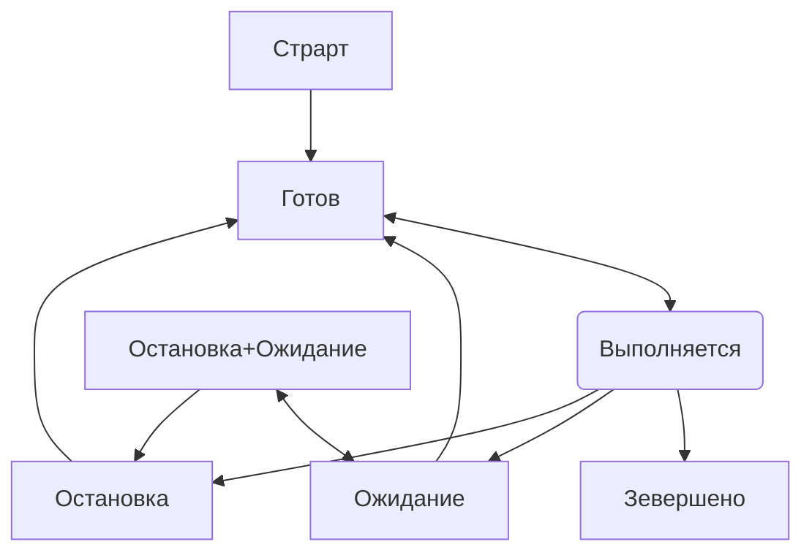

## Вопросы  
Процессы и потоки ОС. Планировщик ОС. Взаимодействие процессов. Память процессов и потоков. Context Switching.
Различные модели многозадачности. Различные профили нагрузки.

1. #### Процессы и потоки ОС.  
   * Определение процесса и потока
   * Различия между процессами и потоками
   * Преимущества и недостатки использования процессов и потоков

2. #### Планировщик ОС
   * Функции планировщика
   * Алгоритмы планирования
   * Приоритеты процессов и потоков

3. #### Взаимодействие процессов
   * Межпроцессное взаимодействие (IPC)
   * Механизмы синхронизации (мьютексы, семафоры, каналы)
   * Проблемы взаимодействия (взаимоблокировки, гонки данных)

4. #### Память процессов и потоков
   * Структура памяти процесса
   * Виртуальная память
   * Разделение памяти между потоками одного процесса

5. #### Context Switching
   * Определение и причины переключения контекста
   * Процесс переключения контекста
   * Влияние на производительность

6. #### Различные модели многозадачности
   * Кооперативная многозадачность
   * Вытесняющая многозадачность
   * Параллелизм и конкурентность в Go

7. #### Различные профили нагрузки
   * CPU-bound задачи
   * I/O-bound задачи
   * Memory-bound задачи
